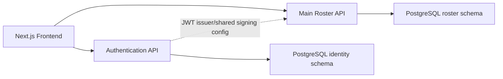
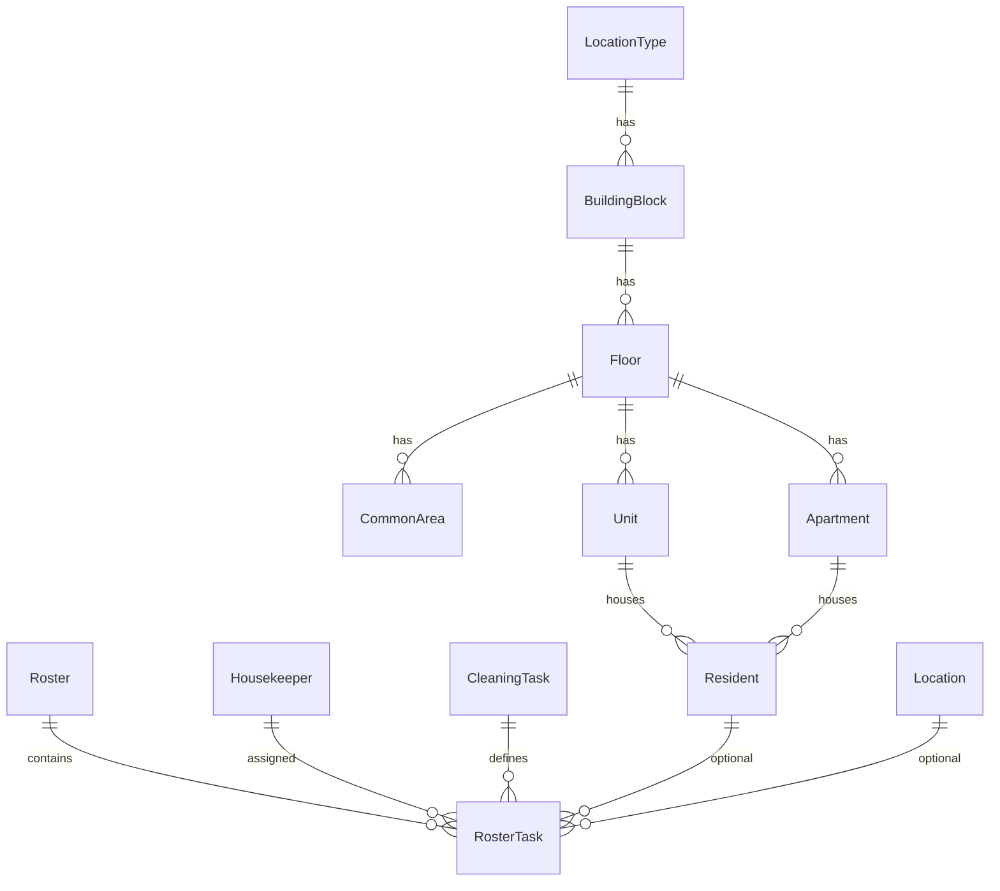

# Roster Management System - Development Documentation

Last updated: 2026-06-18

This document is generated from the current implementation in `C:\Users\tndni\OneDrive\Documents\repo\roaster-housekeeper`. Update this file whenever future code changes introduce new features, APIs, entities, migrations, or business rules.

## Project Overview

### System Purpose

The Roster Management System supports housekeeper scheduling and operational cleaning management. The active implementation manages:

- Authentication and JWT-based access.
- Housekeeper records and login-account provisioning.
- Cleaning task definitions and task categories.
- Location hierarchy management.
- Common Areas, Units, Apartments, and Resident assignments.
- Weekly roster creation, viewing, and export placeholders.

### High-Level Architecture



The frontend stores JWT and refresh-token values in browser storage. The Main Roster API validates JWT bearer tokens issued by the Authentication API.

### Technology Stack

| Layer | Implementation |
| --- | --- |
| Frontend | Next.js 16.1.6, React 19.2.3, TypeScript, Tailwind CSS, lucide-react, sonner |
| Main API | ASP.NET Core, .NET 10, Entity Framework Core 10, Npgsql, Swagger/Swashbuckle |
| Authentication API | ASP.NET Core, .NET 10 target, ASP.NET Identity, EF Core/Npgsql, JWT bearer auth |
| Database | PostgreSQL |
| Auth | JWT access tokens plus persisted refresh tokens |

## Solution Structure

### Active Applications

| Application | Path | Purpose |
| --- | --- | --- |
| Next.js frontend | `roster-web-app` | User interface, authenticated pages, API service clients |
| Main Roster API | `roster-api-app/roster-api-app` | Domain API for housekeepers, rosters, locations, areas, residents, cleaning tasks |
| Authentication API | `roster-auth-app/roster-auth-app` | Identity users, roles, login, refresh tokens, profile/password actions |

### Additional Folder

| Folder | Status |
| --- | --- |
| `house-keeping-roster` | Present in repository, but not referenced by the active `roster-web-app`, `roster-api-app`, or `roster-auth-app` implementation. Treat as legacy or separate work until confirmed otherwise. |

## Implemented Features

### Authentication

- Login against `POST /api/auth/login`.
- JWT access token returned with refresh token.
- Refresh-token endpoint supports access-token renewal.
- Logout clears frontend token storage and can revoke refresh token if passed to API.
- Header login/logout state is driven by frontend auth storage and an `auth-change` browser event.
- Login page is implemented as a popup-style overlay page.

### Housekeeper Management

- Frontend page: `/housekeepers`.
- Lists housekeepers from Main API.
- Add Housekeeper form validates required fields, email, phone, password, status, and employment type.
- Creation flow:
  1. Create housekeeper in Main API.
  2. Register matching auth user in Authentication API with `DefaultUser` role.
  3. Roll back created housekeeper if auth account creation fails.
- Backend enforces duplicate email checks and normalizes email to lowercase.

### Cleaning Task Management

- Frontend page: `/task`.
- CRUD support for cleaning tasks.
- Task category support via `CleaningTaskCategory` enum:
  - `CommunityArea`
  - `Apartment`
  - `UnitOrRoom`
  - `SpecialTask`
- Frontend category dropdown and category filter are implemented.
- Backend validates task category, name, frequency, estimated duration, and duplicate names.

### Location Management

- Frontend page: `/locations`.
- Existing naming convention preserved: `LocationType`.
- Hierarchy:
  - `LocationType`
  - `BuildingBlock`
  - `Floor`
  - `CommonArea`, `Unit`, and `Apartment` under each Floor
- Seeded location types:
  - `Care Unit`
  - `Dementia Unit`
  - `Village Unit`
- CRUD UI manages Building Blocks, Floors, Common Areas, Units, and Apartments inside a single Locations workspace.
- Common Areas, Units, and Apartments are no longer sidebar modules. Their old routes redirect to `/locations`.
- Adding and editing Building Blocks, Floors, Common Areas, Units, and Apartments is handled through popup modals over the current hierarchy view, preserving scroll context.
- Backend supports CRUD for Location Types, Building Blocks, and Floors.

### Area Management

- Frontend page: `/locations`.
- Old routes `/common-areas`, `/units`, and `/apartments` redirect to `/locations`.
- Entities:
  - `CommonArea`
  - `Unit`
  - `Apartment`
- All areas belong to a `Floor`.
- Apartment actions are available under Village Unit floors in the Locations hierarchy, and the form only allows Village Unit floors.
- Backend also enforces Apartment creation/update only under `Village Unit`.

### Resident Management

- Frontend page: `/residents`.
- Residents can be assigned to either a Unit or Apartment.
- Resident assignment dropdown is populated from `GET /api/residents/assignable-areas`.
- Common Areas are intentionally excluded from resident assignment.
- Backend validates exactly one assignment target: `UnitId` or `ApartmentId`.
- Existing legacy resident rows with no assignment can be returned as `Unassigned`; create/update still requires a Unit or Apartment.

### Roster Management

- Frontend pages:
  - `/roster`
  - `/my-schedule`
  - `/export`
- Backend exposes CRUD endpoints for rosters and roster tasks via `RosterDto`.
- Roster tasks can reference:
  - Housekeeper
  - CleaningTask
  - optional legacy `Location`
  - optional Resident
- Export endpoints exist for PDF and Excel, but the service currently returns stub byte content rather than generated documents.

## Database Changes

### Main API Entities

| Entity | Key Fields | Notes |
| --- | --- | --- |
| `Housekeeper` | `Id`, `Name`, `Phone`, `Email`, `Status`, `EmploymentType` | Staff record; auth account is created separately in Authentication API |
| `CleaningTask` | `Id`, `Name`, `Description`, `TaskCategory`, `EstimatedDuration`, `Frequency` | Defines cleaning task types |
| `Location` | `Id`, `Name`, `LocationType`, `Building`, `Floor`, `Notes` | Legacy/flat location model still used by `RosterTask.LocationId` |
| `LocationType` | `Id`, `Name` | Preserved naming; seeded with three unit types |
| `BuildingBlock` | `Id`, `Name`, `LocationTypeId` | Child of LocationType |
| `Floor` | `Id`, `Name`, `FloorNumber`, `BuildingBlockId` | Child of BuildingBlock |
| `CommonArea` | `Id`, `Name`, `Description`, `FloorId` | Child of Floor; not assignable to residents |
| `Unit` | `Id`, `Name`, `UnitNumber`, `Notes`, `FloorId` | Child of Floor; assignable to residents |
| `Apartment` | `Id`, `Name`, `ApartmentNumber`, `Notes`, `FloorId` | Child of Floor; only valid under Village Unit |
| `Resident` | `Id`, `Name`, `RoomNumber`, `Building`, `CleaningFrequency`, `Notes`, `UnitId`, `ApartmentId` | Assigned to Unit or Apartment |
| `Roster` | `Id`, `WeekStartDate`, `CreatedBy`, `CreatedDate` | Parent roster |
| `RosterTask` | `Id`, `RosterId`, `HousekeeperId`, `TaskId`, `LocationId`, `ResidentId`, schedule fields | Roster line item |

### Authentication API Entities

| Entity | Key Fields | Notes |
| --- | --- | --- |
| `User` | Identity fields, `FirstName`, `LastName`, `Initials`, `Status`, `MustChangePassword`, `CreatedAt` | Extends ASP.NET Identity user |
| `RefreshToken` | `Id`, `UserId`, `Token`, `ExpiresAt`, `CreatedAt`, `RevokedAt`, `ReplacedByToken` | Refresh token persistence and revocation |
| `IdentityRole` | Role name | Seeded roles include `SuperAdmin`, `DefaultUser`, `OrganizationUser`, `OrganizationAdmin` |

### Relationships



### Enums

| Enum | Values |
| --- | --- |
| `EmployeeTypes` | `Permanent`, `Casual` |
| `CleaningTaskCategory` | `CommunityArea`, `Apartment`, `UnitOrRoom`, `SpecialTask` |
| `UserStatus` | `Active`, `Pending`, `Inactive` |
| `AppRoles` | `SuperAdmin`, `DefaultUser`, `OrganizationUser`, `OrganizationAdmin` |

### Database Constraints and Business Rules

| Constraint / Rule | Implementation |
| --- | --- |
| Unique `LocationType.Name` | EF unique index |
| Seed Location Types | `Care Unit`, `Dementia Unit`, `Village Unit` seeded in `ApplicationDbContext` |
| Unique Building Block name per Location Type | EF unique index on `{ LocationTypeId, Name }` |
| Unique Floor number per Building Block | EF unique index on `{ BuildingBlockId, FloorNumber }` |
| Unique Common Area name per Floor | EF unique index on `{ FloorId, Name }` |
| Unique Unit number per Floor | EF unique index on `{ FloorId, UnitNumber }` |
| Unique Apartment number per Floor | EF unique index on `{ FloorId, ApartmentNumber }` |
| Apartment only under Village Unit | Backend service validation in `ApartmentService` |
| Resident assigned to Unit or Apartment only | Backend service validation in `ResidentService` |
| Resident cannot be assigned to Common Area | No FK exists from Resident to CommonArea; assignable endpoint excludes CommonArea |

### Main API Migrations

| Migration | Purpose |
| --- | --- |
| `20260527090941_InitialCreate` | Initial Main API schema |
| `20260615063212_AddCleaningTaskCategory` | Adds task category support to Cleaning Tasks |
| `20260616093437_AddLocationHierarchy` | Adds LocationType, BuildingBlock, Floor hierarchy |
| `20260617084447_AddAreaResidentAssignments` | Adds CommonAreas, Units, Apartments, and Resident Unit/Apartment assignments |

### Missing or Incomplete Database Notes

- Authentication API migrations are not documented in this repository scan because the auth migrations folder is ignored by `.gitignore`.
- The Main API still contains a legacy flat `Location` entity alongside the newer LocationType/BuildingBlock/Floor/Area hierarchy.
- There is no database-level check constraint enforcing "Resident must have exactly one of `UnitId` or `ApartmentId`"; this rule is enforced in the service layer.
- There is no database-level check constraint enforcing Apartment under Village Unit; this rule is enforced in the service layer.

## API Documentation

All Main Roster API controllers except the sample weather endpoint are protected with `[Authorize]` and expect `Authorization: Bearer <token>`.

### Common Response Patterns

| Status | Meaning |
| --- | --- |
| `200 OK` | Successful read or action |
| `201 Created` | Successful create |
| `204 No Content` | Successful update/delete |
| `400 Bad Request` | Validation or business-rule failure |
| `401 Unauthorized` | Missing/invalid JWT |
| `404 Not Found` | Entity not found |

### Main Roster API Endpoints

#### Housekeepers

| Method | URL | Description | Request Payload | Response Payload |
| --- | --- | --- | --- | --- |
| `GET` | `/api/housekeepers` | List housekeepers | none | `HousekeeperDto[]` |
| `GET` | `/api/housekeepers/{id}` | Get housekeeper by id | none | `HousekeeperDto` |
| `POST` | `/api/housekeepers` | Create housekeeper | `HousekeeperDto` | created `HousekeeperDto` |
| `PUT` | `/api/housekeepers/{id}` | Update housekeeper | `HousekeeperDto` | none |
| `DELETE` | `/api/housekeepers/{id}` | Delete housekeeper | none | none |

`HousekeeperDto`: `id`, `name`, `phone`, `email`, `status`, `employmentType`.

#### Cleaning Tasks

| Method | URL | Description | Request Payload | Response Payload |
| --- | --- | --- | --- | --- |
| `GET` | `/api/cleaningtasks` | List cleaning tasks | none | `CleaningTaskDto[]` |
| `GET` | `/api/cleaningtasks/{id}` | Get cleaning task by id | none | `CleaningTaskDto` |
| `POST` | `/api/cleaningtasks` | Create cleaning task | `CleaningTaskRequestDto` | created `CleaningTaskDto` |
| `PUT` | `/api/cleaningtasks/{id}` | Update cleaning task | `CleaningTaskRequestDto` | none |
| `DELETE` | `/api/cleaningtasks/{id}` | Delete cleaning task | none | none |

`CleaningTaskRequestDto`: `name`, `description`, `taskCategory`, `estimatedDuration`, `frequency`.

#### Location Types

| Method | URL | Description | Request Payload | Response Payload |
| --- | --- | --- | --- | --- |
| `GET` | `/api/locationtypes` | List location types with building blocks/floors | none | `LocationTypeDto[]` |
| `GET` | `/api/locationtypes/{id}` | Get location type | none | `LocationTypeDto` |
| `POST` | `/api/locationtypes` | Create location type | `LocationTypeRequestDto` | created `LocationTypeDto` |
| `PUT` | `/api/locationtypes/{id}` | Update location type | `LocationTypeRequestDto` | none |
| `DELETE` | `/api/locationtypes/{id}` | Delete location type | none | none |

`LocationTypeRequestDto`: `name`.

#### Building Blocks

| Method | URL | Description | Request Payload | Response Payload |
| --- | --- | --- | --- | --- |
| `GET` | `/api/buildingblocks` | List building blocks | none | `BuildingBlockDto[]` |
| `GET` | `/api/buildingblocks/{id}` | Get building block | none | `BuildingBlockDto` |
| `POST` | `/api/buildingblocks` | Create building block | `BuildingBlockRequestDto` | created `BuildingBlockDto` |
| `PUT` | `/api/buildingblocks/{id}` | Update building block | `BuildingBlockRequestDto` | none |
| `DELETE` | `/api/buildingblocks/{id}` | Delete building block | none | none |

`BuildingBlockRequestDto`: `name`, `locationTypeId`.

#### Floors

| Method | URL | Description | Request Payload | Response Payload |
| --- | --- | --- | --- | --- |
| `GET` | `/api/floors` | List floors | none | `FloorDto[]` |
| `GET` | `/api/floors/{id}` | Get floor | none | `FloorDto` |
| `GET` | `/api/floors/by-building-block/{buildingBlockId}` | List floors under a building block | none | `FloorDto[]` |
| `POST` | `/api/floors` | Create floor | `FloorRequestDto` | created `FloorDto` |
| `PUT` | `/api/floors/{id}` | Update floor | `FloorRequestDto` | none |
| `DELETE` | `/api/floors/{id}` | Delete floor | none | none |

`FloorRequestDto`: `name`, `floorNumber`, `buildingBlockId`.

#### Common Areas

| Method | URL | Description | Request Payload | Response Payload |
| --- | --- | --- | --- | --- |
| `GET` | `/api/commonareas` | List common areas | none | `CommonAreaDto[]` |
| `GET` | `/api/commonareas/by-floor/{floorId}` | List common areas under a floor | none | `CommonAreaDto[]` |
| `GET` | `/api/commonareas/{id}` | Get common area | none | `CommonAreaDto` |
| `POST` | `/api/commonareas` | Create common area | `CommonAreaRequestDto` | created `CommonAreaDto` |
| `PUT` | `/api/commonareas/{id}` | Update common area | `CommonAreaRequestDto` | none |
| `DELETE` | `/api/commonareas/{id}` | Delete common area | none | none |

`CommonAreaRequestDto`: `name`, `description`, `floorId`.

#### Units

| Method | URL | Description | Request Payload | Response Payload |
| --- | --- | --- | --- | --- |
| `GET` | `/api/units` | List units | none | `UnitDto[]` |
| `GET` | `/api/units/by-floor/{floorId}` | List units under a floor | none | `UnitDto[]` |
| `GET` | `/api/units/assignable-areas` | List units as resident-assignable areas | none | `AssignableAreaDto[]` |
| `GET` | `/api/units/{id}` | Get unit | none | `UnitDto` |
| `POST` | `/api/units` | Create unit | `UnitRequestDto` | created `UnitDto` |
| `PUT` | `/api/units/{id}` | Update unit | `UnitRequestDto` | none |
| `DELETE` | `/api/units/{id}` | Delete unit | none | none |

`UnitRequestDto`: `name`, `unitNumber`, `notes`, `floorId`.

#### Apartments

| Method | URL | Description | Request Payload | Response Payload |
| --- | --- | --- | --- | --- |
| `GET` | `/api/apartments` | List apartments | none | `ApartmentDto[]` |
| `GET` | `/api/apartments/by-floor/{floorId}` | List apartments under a floor | none | `ApartmentDto[]` |
| `GET` | `/api/apartments/{id}` | Get apartment | none | `ApartmentDto` |
| `POST` | `/api/apartments` | Create apartment | `ApartmentRequestDto` | created `ApartmentDto` |
| `PUT` | `/api/apartments/{id}` | Update apartment | `ApartmentRequestDto` | none |
| `DELETE` | `/api/apartments/{id}` | Delete apartment | none | none |

`ApartmentRequestDto`: `name`, `apartmentNumber`, `notes`, `floorId`.

#### Residents

| Method | URL | Description | Request Payload | Response Payload |
| --- | --- | --- | --- | --- |
| `GET` | `/api/residents` | List residents | none | `ResidentDto[]` |
| `GET` | `/api/residents/assignable-areas` | List Units and Apartments for resident assignment | none | `AssignableAreaDto[]` |
| `GET` | `/api/residents/{id}` | Get resident | none | `ResidentDto` |
| `POST` | `/api/residents` | Create resident | `ResidentRequestDto` | created `ResidentDto` |
| `PUT` | `/api/residents/{id}` | Update resident | `ResidentRequestDto` | none |
| `DELETE` | `/api/residents/{id}` | Delete resident | none | none |

`ResidentRequestDto`: `name`, `roomNumber`, `building`, `cleaningFrequency`, `notes`, `unitId`, `apartmentId`.

#### Rosters

| Method | URL | Description | Request Payload | Response Payload |
| --- | --- | --- | --- | --- |
| `GET` | `/api/rosters` | List rosters | none | `RosterDto[]` |
| `GET` | `/api/rosters/{id}` | Get roster | none | `RosterDto` |
| `POST` | `/api/rosters` | Create roster with tasks | `RosterDto` | created `RosterDto` |
| `PUT` | `/api/rosters/{id}` | Replace roster fields and tasks | `RosterDto` | none |
| `DELETE` | `/api/rosters/{id}` | Delete roster | none | none |
| `GET` | `/api/rosters/{id}/export/pdf` | Export roster PDF | none | PDF file bytes; currently stub content |
| `GET` | `/api/rosters/{id}/export/excel` | Export roster Excel | none | XLSX file bytes; currently stub content |

`RosterDto`: `id`, `weekStartDate`, `createdBy`, `createdDate`, `rosterTasks`.

`RosterTaskDto`: `id`, `rosterId`, `housekeeperId`, `housekeeperName`, `taskId`, `taskName`, `locationId`, `locationName`, `residentId`, `residentName`, `scheduledDate`, `startTime`, `endTime`, `frequencyType`, `notes`.

#### Sample Endpoint

| Method | URL | Description | Request Payload | Response Payload |
| --- | --- | --- | --- | --- |
| `GET` | `/WeatherForecast` | Template/sample endpoint | none | weather sample array |

### Authentication API Endpoints

| Method | URL | Description | Request Payload | Response Payload |
| --- | --- | --- | --- | --- |
| `POST` | `/api/auth/register` | Register user and assign role | `CreateUserDto` | `{ message, status, email }` or validation errors |
| `POST` | `/api/auth/login` | Login active user | `{ email, password }` | `{ user, accessToken, expiresIn, tokenType, refreshToken, mustChangePassword }` |
| `POST` | `/api/auth/refresh` | Rotate refresh token and issue new access token | `{ refreshToken }` | `{ accessToken, expiresIn, tokenType, refreshToken }` |
| `POST` | `/api/auth/logout` | Revoke refresh token if supplied | `{ refreshToken? }` | `{ message }` |
| `GET` | `/api/me` | Decode bearer token and return current user | bearer token header | `{ user }` |
| `POST` | `/api/auth/change-password` | Change password for authorized user | `{ currentPassword, newPassword }` | `{ message }` |
| `PUT` | `/api/auth/update-profile` | Update authorized user profile | `{ firstName, lastName }` | `{ message, user }` |
| `GET` | `/WeatherForecast` | Template/sample endpoint | none | weather sample array |

`CreateUserDto`: `email`, `password`, `firstName`, `lastName`, `userRole`, `requestedOrgName`.

## Frontend Documentation

### Pages

| Route | File | Purpose | Status |
| --- | --- | --- | --- |
| `/` | `app/page.tsx` | Dashboard/home entry | Implemented |
| `/login` | `app/login/page.tsx` | Popup-style login page | Implemented |
| `/dashboard` | `app/dashboard/page.tsx` | Simple dashboard | Basic |
| `/admin` | `app/admin/page.tsx` | Admin placeholder | Incomplete/basic |
| `/housekeepers` | `app/housekeepers/page.tsx` | Housekeeper list and add form | Implemented |
| `/task` | `app/task/page.tsx` | Cleaning task CRUD | Implemented |
| `/locations` | `app/locations/page.tsx` | Unified Location hierarchy, Building Block, Floor, Common Area, Unit, and Apartment management with popup add/edit forms | Implemented |
| `/common-areas` | `app/common-areas/page.tsx` | Redirects to `/locations` | Redirect only |
| `/units` | `app/units/page.tsx` | Redirects to `/locations` | Redirect only |
| `/apartments` | `app/apartments/page.tsx` | Redirects to `/locations` | Redirect only |
| `/residents` | `app/residents/page.tsx` | Resident CRUD and assignment | Implemented |
| `/roster` | `app/roster/page.tsx` | Roster management | Implemented/basic |
| `/my-schedule` | `app/my-schedule/page.tsx` | Schedule view | Implemented/basic |
| `/export` | `app/export/page.tsx` | Roster export UI | Implemented; backend export is stubbed |

### Navigation Structure

`components/sidenav.tsx` contains the active side navigation:

1. Dashboard
2. Housekeepers
3. Locations
4. Residents
5. Weekly Roster
6. My Schedule
7. Export
8. Tasks

`components/navbar.tsx` contains top navigation/auth display and login/logout behavior.

### Components

| Component | Purpose |
| --- | --- |
| `components/auth/LoginForm.tsx` | Login form with mounted guard to avoid hydration issues |
| `components/areas/AreaManagementPage.tsx` | Legacy shared CRUD UI for old standalone area pages; current sidebar UX uses the unified `/locations` workspace |
| `components/sidenav.tsx` | Sidebar route navigation |
| `components/navbar.tsx` | Top nav with auth state |
| `components/ui/*` | Reusable UI primitives: Button, Card, Input, Textarea, Badge, etc. |
| `components/theme-provider.tsx`, `components/theme-toggle.tsx` | Theme support |

### Frontend Services

| Service | Purpose |
| --- | --- |
| `apiClient.ts` | Attaches bearer token, refreshes once on 401, normalizes API errors |
| `authService.ts` | Login, register user, refresh, logout, token/user storage |
| `housekeeperService.ts` | Housekeeper API calls |
| `cleaningTaskService.ts` | Cleaning Task API calls |
| `locationService.ts` | LocationType, BuildingBlock, Floor API calls |
| `areaService.ts` | Common Area, Unit, Apartment API calls |
| `residentService.ts` | Resident and assignable-area API calls |
| `rosterService.ts` | Roster CRUD and export API calls |

### Frontend Validation

| Area | Validation |
| --- | --- |
| Login | Required username/password via form controls; API error display |
| Housekeeper | Required name/email/phone/password/status/employment type; email regex; phone regex; password min 8 with uppercase/lowercase/number |
| Cleaning Task | Required name/category/frequency; estimated duration range; client mirrors backend categories |
| Location Management | Required building block/floor/area fields; building block, floor, and area actions are managed in one hierarchy |
| Area Management | Required floor/name; Unit and Apartment require number; Apartment floor dropdown filters to Village Unit |
| Resident Management | Required name, assignment, cleaning frequency; assignment dropdown contains Units and Apartments only |

## Business Rules

- `LocationType` naming is preserved and must not be renamed.
- Seeded Location Types are `Care Unit`, `Dementia Unit`, and `Village Unit`.
- Each `LocationType` can have many `BuildingBlock` records.
- Each `BuildingBlock` can have many `Floor` records.
- Each `Floor` can have Common Areas, Units, and Apartments.
- Apartments are only available under floors belonging to `Village Unit`.
- Units can be created under any existing Floor.
- Common Areas can be created under any existing Floor.
- Residents can stay only in Units or Apartments.
- Residents cannot be assigned to Common Areas.
- Resident create/update requires exactly one of `UnitId` or `ApartmentId`.
- Cleaning Tasks require a category.
- Housekeeper email must be unique in the Main API.
- Auth user email must be unique in the Authentication API.
- `OrganizationAdmin` users register with `Pending` status; other roles register with `Active` status.
- Login only succeeds for users with `Active` status.
- Refresh tokens are rotated: old token is revoked and replaced with a new token.

## Authentication Flow

### Login Flow

1. User opens `/login`.
2. `LoginForm` collects username/email and password.
3. Frontend calls `POST /api/auth/login` on Authentication API.
4. Authentication API validates:
   - user exists,
   - user status is `Active`,
   - password is correct.
5. API returns access token, refresh token, user summary, and `mustChangePassword`.
6. Frontend stores:
   - `token` in `localStorage` and cookie,
   - `refreshToken` in `localStorage`,
   - `user` in `localStorage`.
7. Frontend dispatches `auth-change` event and routes to `/dashboard`.

### JWT Flow

- Authentication API signs JWTs with configured issuer, audience, and signing key.
- Main Roster API validates issuer, audience, lifetime, and signing key.
- `apiClient` attaches `Authorization: Bearer <token>` to Main API requests.
- If the Main API returns `401`, `apiClient` attempts one refresh using `POST /api/auth/refresh`.

### Logout Flow

- Frontend `logout()` clears token, refresh token, user, and auth cookie.
- Frontend dispatches `auth-change`.
- Auth API supports `POST /api/auth/logout` for refresh-token revocation, but the current frontend logout helper clears local storage only and does not call the API logout endpoint.

## Current Folder Structure

```text
roaster-housekeeper/
|-- DEVELOPMENT_DOCUMENTATION.md
|-- instruction.md
|-- roster-web-app/
|   |-- app/
|   |   |-- admin/
|   |   |-- apartments/
|   |   |-- common-areas/
|   |   |-- dashboard/
|   |   |-- export/
|   |   |-- hooks/
|   |   |-- housekeepers/
|   |   |-- locations/
|   |   |-- login/
|   |   |-- my-schedule/
|   |   |-- residents/
|   |   |-- roster/
|   |   |-- services/
|   |   |-- task/
|   |   |-- units/
|   |   |-- layout.tsx
|   |   |-- page.tsx
|   |-- components/
|   |   |-- areas/
|   |   |-- auth/
|   |   |-- ui/
|   |   |-- navbar.tsx
|   |   |-- sidenav.tsx
|   |-- lib/
|   |-- types/
|   |-- public/
|   |-- package.json
|-- roster-api-app/
|   |-- roster-api-app/
|   |   |-- Controllers/
|   |   |-- Data/
|   |   |-- DTOs/
|   |   |-- Entities/
|   |   |   |-- Enums/
|   |   |-- Migrations/
|   |   |-- Repositories/
|   |   |-- Services/
|   |   |-- Program.cs
|-- roster-auth-app/
|   |-- roster-auth-app/
|   |   |-- Controllers/
|   |   |-- Dtos/
|   |   |   |-- Users/
|   |   |-- Extensions/
|   |   |-- Models/
|   |   |-- Seeders/
|   |   |-- Utilities/
|   |   |   |-- Enums/
|   |   |-- Program.cs
|-- house-keeping-roster/
|   |-- app/
|   |-- components/
|   |-- lib/
```

## Technical Decisions

| Decision | Reason |
| --- | --- |
| Preserve `LocationType` naming | User requirement and existing code convention |
| Add separate `CommonArea`, `Unit`, and `Apartment` entities | Supports explicit area behavior and avoids overloading generic location strings |
| Keep legacy `Location` entity | Existing `RosterTask.LocationId` still references it; removal would require broader roster refactor |
| Enforce key business rules in services | Keeps API behavior consistent across Swagger/frontend callers |
| Add frontend and backend validation | Improves user feedback while preserving server-side correctness |
| Consolidate area management under `/locations` | Common Areas, Units, and Apartments are business subcategories of Locations, so the UI now follows the operational hierarchy instead of exposing them as independent sidebar modules |
| Use popup add/edit forms for Location records | Adding or editing Building Blocks, Floors, Common Areas, Units, and Apartments opens a modal over the current Locations hierarchy so users do not lose their place |
| Use `JsonStringEnumConverter` in Main API | Frontend can send/read enum values as strings |
| Store JWT in localStorage and cookie | Existing frontend pattern supports client API calls and middleware/server checks |
| Roll back housekeeper on auth-registration failure | Prevents orphan housekeeper records without login accounts during create flow |

## Missing or Incomplete Implementations

- Roster PDF and Excel exports are stub implementations returning text bytes.
- `AdminPage` is a placeholder.
- `DashboardPage` is basic and does not yet show operational metrics.
- `my-schedule` implementation appears basic and should be reviewed before production use.
- Housekeeper cards show Edit/Remove buttons, but the visible buttons are not wired to update/delete handlers in the current scanned implementation.
- Authentication API migrations are not visible in source due ignore rules.
- Frontend uses Prisma/Clerk dependencies and generated Prisma files, but the active auth flow uses the custom Authentication API JWT service. Clerk/Prisma usage is not clearly integrated in the active flow.
- Main API Swagger title currently says `JWTToken_Auth_API`, which does not match the Main Roster API domain.
- Auth API `GET /api/me`, change-password, and update-profile manually decode JWT instead of using claims from the authenticated principal.

## Future Enhancements

1. Replace roster export stubs with real PDF/XLSX generation.
2. Refactor roster tasks from legacy `LocationId` to the new area model where appropriate.
3. Add database check constraints for:
   - Resident exactly one assignment target.
   - Apartment under Village Unit.
4. Add integration tests for business rules and endpoint contracts.
5. Add frontend edit/delete flows for Housekeepers.
6. Add role-based authorization policies for admin-only screens and destructive actions.
7. Persist logout revocation by calling `POST /api/auth/logout` from the frontend.
8. Add dashboard metrics: active housekeepers, weekly task count, unassigned tasks, upcoming rosters.
9. Add resident assignment availability/occupancy rules if one Unit/Apartment should have limited residents.
10. Clean up sample `WeatherForecast` endpoints.
11. Clarify or remove unused Clerk/Prisma dependencies if the custom JWT auth flow remains the chosen direction.
12. Add API versioning and consistent Swagger metadata.
13. Add seed data for initial buildings/floors if required for onboarding.
14. Create a deployment guide for environment variables, database migrations, and startup order.
